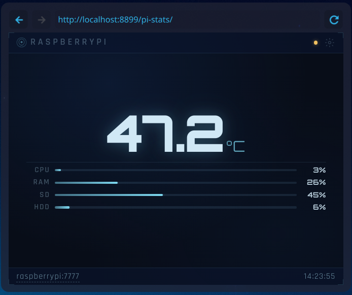

# Pi Monitor

> **Built entirely with [Claude Code](https://claude.ai/code) by Anthropic** — every line of HTML, CSS, JavaScript, Python, and documentation in this project was written by Claude.


A lightweight, self-hosted system monitor widget for a Raspberry Pi, designed to run as a KDE Plasma desktop widget on CachyOS (or any browser-based widget host). Displays CPU temperature, CPU usage, RAM usage, and disk usage for all mounted filesystems — live, with a 2-second refresh.



---

## How it works

The system has two parts:

1. **`tempd.py`** — a minimal Python HTTP server running on the Pi. It reads `/proc/stat`, `/proc/meminfo`, `/proc/mounts`, and `vcgencmd measure_temp`, then serves them as a single JSON response on port `7777`.

2. **`pi-monitor/`** — a static web app (HTML + CSS + JS) served locally from your desktop via a one-line Python HTTP server on port `8899`. It polls the Pi API every 2 seconds and renders the data.

The widget is opened in a KDE Plasma Web View applet pointed at `http://localhost:8899/index.html`.

---

## Requirements

| Component | Requirement |
|-----------|-------------|
| Raspberry Pi | Any model running Pi OS / Debian with `vcgencmd` available |
| Desktop | Any machine that can run a local web server and reach the Pi (LAN or Tailscale) |
| Browser / host | Any WebView2 / Chromium-based widget host, or just a browser tab |

No npm, no build step, no dependencies beyond the Python standard library.

---

## File structure

```
pi-monitor/               ← serve this directory from your desktop
├── index.html            ← markup only; no inline scripts or styles
├── styles.css            ← all visual design; CSS custom properties
├── app.js                ← all application logic; fully JSDoc-documented
├── favicon.png           ← browser tab / bookmark icon
├── screenshot.png        ← widget preview image (used in README)
├── README.md             ← this file
└── TECHNICAL.md          ← API contract, architecture, and extension guide

tempd/                    ← deploy this on the Raspberry Pi
└── tempd.py              ← Python HTTP API server
    tempd.service         ← systemd unit file
```

---

## Setup

### 1. Pi — deploy the API server

Copy `tempd.py` to the Pi:

```bash
sudo mkdir -p /opt/tempd
sudo cp tempd.py /opt/tempd/tempd.py
```

Install the systemd service and start it:

```bash
sudo cp tempd.service /etc/systemd/system/tempd.service
sudo systemctl daemon-reload
sudo systemctl enable --now tempd
```

Verify it's running:

```bash
curl http://localhost:7777/
# Should return JSON with temp, cpu, ram, disks
```

The server binds to `0.0.0.0:7777`. Make sure port `7777` is reachable from your desktop — either on the local network or via Tailscale.

---

### 2. Desktop — serve the widget files

Add the widget server as a systemd user service so it starts automatically with your session.

Create `~/.config/systemd/user/widget-server.service`:

```ini
[Unit]
Description=Local widget HTTP server
After=network.target

[Service]
WorkingDirectory=%h/widgets
ExecStart=/usr/bin/python3 -m http.server 8899
Restart=always

[Install]
WantedBy=default.target
```

Copy the widget files and enable the service:

```bash
mkdir -p ~/widgets/pi-monitor
cp index.html styles.css app.js ~/widgets/pi-monitor/

systemctl --user daemon-reload
systemctl --user enable --now widget-server
```

---

### 3. Desktop — add the Plasma widget

1. Right-click the desktop → **Add Widgets** → **Get New Widgets** → search for **Web Browser** (or use the built-in **Web View** applet).
2. Add it to the desktop and resize it to approximately **340 × 420 px** (scales fluidly).
3. Set the URL to `http://localhost:8899/pi-monitor/index.html`.

If you access the Pi over Tailscale, the default URL `http://raspberrypi:7777/` will resolve via MagicDNS. For a direct LAN IP, open Settings in the widget and change the endpoint.

---

## Configuration

All settings are stored in the browser's `localStorage` — no config files to edit.

| Setting | How to change | Default |
|---------|---------------|---------|
| API endpoint URL | Click the host label in the footer, or Settings → Endpoint | `http://raspberrypi:7777/` |
| Display mode | Click any metric value, or Settings → RAM & Disk Display | Size (`used/total`) |
| Disk labels | Settings → Disk Labels → per-disk input + SAVE | Auto-derived from mount path |

To reset everything to factory defaults: **Settings → RESET ALL**.

---

## Colour thresholds

| Metric | Amber | Red |
|--------|-------|-----|
| CPU temperature | ≥ 55 °C | ≥ 75 °C |
| Bar usage (RAM, disks) | ≥ 65 % | ≥ 85 % |

Thresholds are defined in the `CONFIG` object at the top of `app.js` and can be changed there without touching anything else.

---

## Tailscale / remote access

If your Pi is on Tailscale, `raspberrypi` resolves via MagicDNS from any device on your tailnet. No port-forwarding required. The widget will work identically whether you're on the local network or remote.

---

## Troubleshooting

**Footer shows `ERR: Request timed out`**
The Pi is reachable but `tempd` is not responding within 5 seconds. Check `systemctl status tempd` on the Pi.

**Footer shows `ERR: Server unreachable`**
DNS resolution failed or the connection was refused. Check that:
- The Pi is online (`ping raspberrypi` or `ping <tailscale-ip>`)
- `tempd` is running (`systemctl status tempd`)
- The port isn't blocked by a firewall (`sudo ufw status`)

**Footer shows `ERR: HTTP 404` or similar**
The URL is wrong. Click the error footer's input field, correct the URL, and press Enter.

**Bars show `0%` / values show `--`**
The widget loaded but hasn't received its first API response yet — normal for the first 1–2 seconds. If it persists, check the endpoint URL in Settings.

**Disk labels are wrong or missing**
Open Settings → Disk Labels. The mount paths are shown above each input. Enter a label (max 8 characters) and press SAVE. Labels survive page reloads via `localStorage`.

---

## Updating tempd.py

The API is intentionally minimal. If you add fields to the JSON response in `tempd.py`, they will be ignored by the widget until you add corresponding UI in `app.js`. The widget will not break on unknown fields.

After editing `tempd.py` on the Pi:

```bash
sudo systemctl restart tempd
```

---

## License

MIT — do whatever you want with it.
